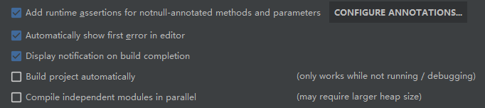
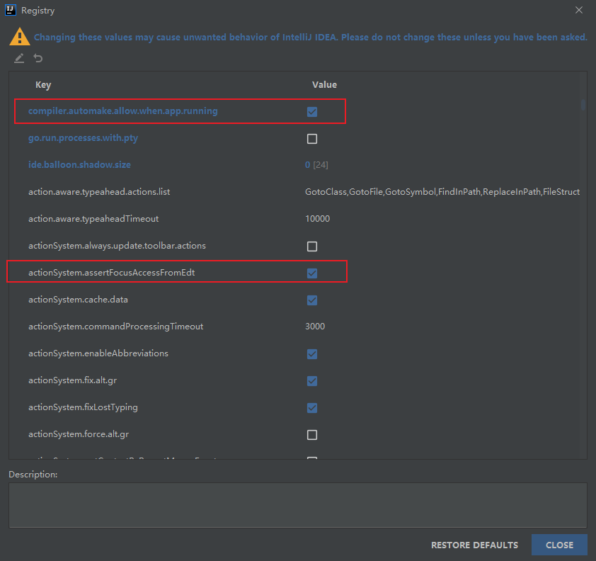

##一、子模块建立思路：
1.建module

2.改POM

3.建YAML

4.主启动

5.业务类

##二、项目添加热部署功能
1.需要热部署的项目添加热部署工具
```xml
<dependency>
    <groupId>org.springframework.boot</groupId>
    <artifactId>spring-boot-devtools</artifactId>
    <scope>runtime</scope>
    <optional>true</optional>
</dependency>
```

2.给父类POM文件添加插件
````xml
<build>
    <finalName>你自己的工程名字</finalName>
    <plugins>
      <plugin>
        <groupId>org.springframework.boot</groupId>
        <artifactId>spring-boot-maven-plugin</artifactId>
        <configuration>
          <fork>true</fork>
          <addResources>true</addResources>
        </configuration>
      </plugin>
    </plugins>
  </build>
````

3.开启自动编译
设置-build-compiler-


4.更新值
ctrl+shift+alt+/打开设置页面


5.重启Idea
##三、restTemplate
1.提供了多种便捷访问远程Http服务的方法
是一种简单便捷的访问restful服务模板你类，spring提供的访问客户端的模板工具集

2.官网地址：
使用：
  使用restTemplate访问restful接口非常的简单粗暴无脑。（url,requestMap,ResponseBean.class)这三个参数分别代表REST请求地址、请求参数、HTTP响应转换被转换成的对象类型。

##四、 Eureka(已不再维护)
服务注册中心

Eureka Serve提供服务注册

Eureka Client通过注册中心进行访问

多个服务互相注册，相互守望
集群：

改pom

修改映射配置，hosts文件

写yml

@LoadBalanced 赋予restTemplate负载均衡的能力

Ribbon和Eureka整合后Consumer可以直接调用服务而不关心地址和端口号，且该服务还有负载功能了

保护模式：微服务不可用了，不会立刻清理，依旧会对该微服务信息进行保存；属于CAP里面的AP；高可用，分区容错
>禁止自我保护
````yaml
service端：

eureka:
  server:
    enable-self-preservation: false #关闭自我保护机制
    eviction-interval-timer-in-ms: 2000 
````
````yaml
客户端：
    #Eureka客户端向服务端发送心跳的时间间隔，单位为秒(默认是30秒)
    #lease-renewal-interval-in-seconds: 1
    #Eureka服务端在收到最后一次心跳后等待时间上限，单位为秒(默认是90秒)，超时将剔除服务
    #lease-expiration-duration-in-seconds: 2
````

##五、服务发现Discovery
````java
import org.springframework.cloud.client.discovery.DiscoveryClient;

@Resource
private DiscoveryClient discoveryClient;
````